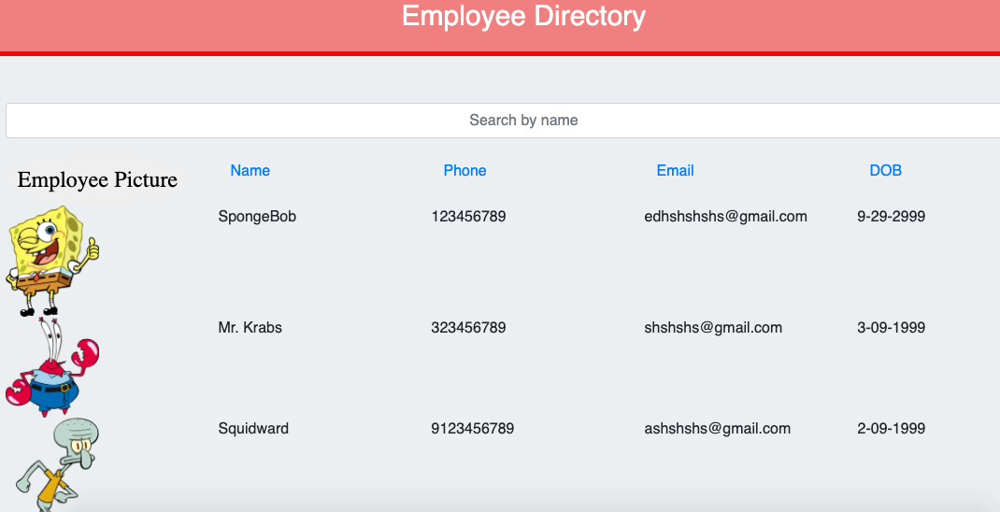

# employeeDirectoryReact

An employee directory is created from a given Json file of employees.

# Requirement:

 * Sort the table by at least one category 

  * Filter the users by at least one property.

# Functionality:
 This react application is deployed on heroku. As soon as the application starts, it brings out the list of employees. These employees have  certain nonsensitive data:
                                                * Employee picture
                                                * Name
                                                * Phone#
                                                * Email address
                                                * Date of birth    

   From this list of employees, they can be searched by typing in their name into search box individually. Also, emplyees can be sorted based on all of their data types. i.e; once you click on the name link, it will rearrange them alphabatically. Or if you click on the email, phone, dob link, it will  rearrange them accordingly.

# Display Demo:

# Deployed application link :
               
               
* https://hmsalmans.github.io/Random-Password-Generator/

